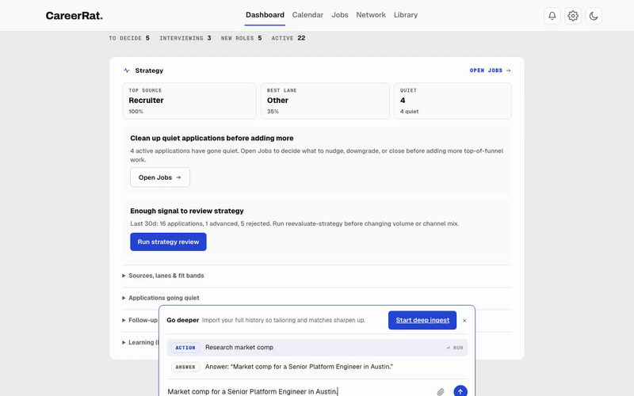
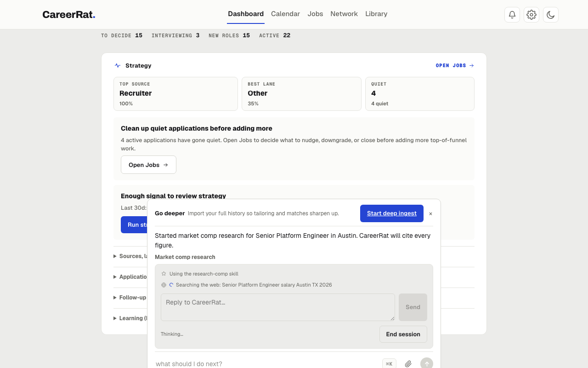

<p align="center">
  
</p>

<h1 align="center">CareerRat</h1>

<p align="center"><strong>Reads the posting, writes only what's true, keeps score of your search.</strong></p>

<p align="center">
  <a href="https://www.npmjs.com/package/careerrat"></a>
  <a href="package.json">=24"></a>
  <a href="LICENSE"></a>
  <br>
  <a href="https://github.com/CodesWhat/careerrat/actions/workflows/ci-verify.yml"></a>
  <a href="https://securityscorecards.dev/viewer/?uri=github.com/CodesWhat/careerrat"></a>
  <br>
  <a href="https://www.npmjs.com/package/careerrat"></a>
</p>

<hr>

## Contents

- [Docs](https://careerrat.com/docs)
- [Quick Start](#quick-start)
- [Why CareerRat](#why-careerrat)
- [Features](#features)
- [Code signing policy](docs/CODE_SIGNING_POLICY.md)
- [Roadmap](#roadmap)
- [Community & Support](#community--support)

<hr>

## Quick Start

Choose the AI CLI for the way you run CareerRat:

- The packaged desktop app currently requires **Claude Code 2.1.241 or newer**
  for in-app skill and chat execution. It detects Codex and other CLIs, but
  leaves them disabled until they provide an equivalent enforceable per-call
  tool, path, and network boundary.
- The terminal workspace-agent flow supports Claude Code or Codex:
  `npm install -g @anthropic-ai/claude-code` or
  `npm install -g @openai/codex`.

**On an Apple Silicon Mac**: download the signed, notarized app from the
[latest release](https://github.com/CodesWhat/careerrat/releases/latest), or
`brew install --cask codeswhat/tap/careerrat`. Install and sign in to Claude
Code 2.1.241 or newer before first run.

**On Windows x64**: the installer is built and installed in Windows CI. A
public installer will appear only after SignPath Foundation approval and a
valid Authenticode signature. Current status, install behavior, and Microsoft
Store prerequisites are in [Windows installation and release status](docs/WINDOWS.md).

**On any other platform**, or if you'd rather use the terminal: install with
npm (requires **Node.js 24 or newer**, check with `node -v`), then run it:

```bash
npm install -g careerrat
careerrat start claude    # or: careerrat start codex
```

Either path sets up your workspace, opens the local app at
`http://localhost:7777`, and hands you off to the agent. From there you just talk to it, and watch it work:
each step shows up as a small activity line, reading your resume, searching the
web, writing, instead of narrated text. No dashboard to learn first, no settings
to get right before it's useful.

### Your first hour

1. **Let it onboard you.** A conversation, not a form: it asks what roles you
   want, what you'll accept, what you won't, and the real work you've done, then
   builds your profile from the answers. Want to kick the tires first? Say
   *"set me up with a quick sample profile."*
2. **Paste a job posting**, a link, or the sample in `examples/sample-jobs/`, and
   say *"evaluate this."* You'll get a verdict: keep it or cut it, how well it
   actually fits, whether the money works, and what to do next. All from a real
   read of the posting, not a keyword match. You'll see it fetch and read the
   posting as activity lines before the verdict lands.
3. **Say "write a résumé and cover letter for this."** It builds them from your
   own evidence and refuses to invent anything you didn't tell it.
4. **Paste a recruiter email** and say *"draft a reply."* It writes the reply and
   remembers the thread, so the next one has context.
5. **Open `http://localhost:7777`** and watch the job land, move through your
   funnel, and pick up history as you go. Every step in the chat shows as a
   plain-language activity line, an icon plus a label like "Searching the web"
   or "Reading files," with a spinner that settles once it's done. The
   assistant only speaks up to ask a question or hand you a result.

**One first-run thing that looks broken but isn't:** before you've onboarded,
`careerrat doctor` will report your setup is incomplete and list `candidate/*.yml`
files to create. That's expected. Onboarding fills them in.

<p align="center">
  
</p>

<p align="center"><em>Activity lines streaming while CareerRat researches market comp.</em></p>

### Everyday commands

```bash
careerrat next       # the one thing worth doing next
careerrat doctor     # check your setup is healthy
careerrat update     # pull the latest code; your data is untouched
```

If the local app is already running, the update relaunches that recorded
CareerRat process on the updated code. Unrelated processes are never stopped;
CareerRat picks another loopback port instead.

The local app comes up with `careerrat start`. To run it on its own:

```bash
careerrat tracker        # snapshot tracker.json for recovery
careerrat tracker-dev    # serve http://localhost:7777 with live data updates
```

**Useful flags on `start`:** `--no-agent` (workspace + local app only),
`--no-dashboard`, `--agent <name>` (override with a compatible agent command),
`--port <n>` (default 7777).

### Running from source

```bash
git clone https://github.com/CodesWhat/careerrat
cd careerrat
npm install
npm run hooks:install
npm link
careerrat start claude
```

<hr>

## Why CareerRat

CareerRat is a job-search workspace that runs on your own machine. Tell it what
you're actually looking for, once. It reads real job postings and tells you which
ones are worth your time, writes applications from things you've genuinely done,
drafts your recruiter replies, preps you for interviews, and keeps track of where
everything stands, so you're not rebuilding that picture from memory.

No account, no CareerRat server, no telemetry. CareerRat never phones home, and
your files stay on your machine. What does go out: your AI CLI talks to its own
provider to do the work, same as any other task you'd give it, and the app
fetches public resources like job postings and company logos from the services
that host them. The packaged desktop app also checks GitHub once a day for a
newer release and shows an in-app notice, nothing more; it never downloads or
installs anything on its own, and you can turn that off in Settings. See
[privacy](https://careerrat.com/docs/advanced/privacy) for the details.
Release trust and the pending Windows signing process are documented in the
[Code signing policy](docs/CODE_SIGNING_POLICY.md).

Most job tools match keywords, then spray a hundred applications and hope one
sticks. CareerRat won't write a single line of a cover letter until it has read
the whole posting and checked it against what you said you want: your comp
floor, your location, your dealbreakers. Jobs that don't clear that bar, it
tells you to skip, and says why.

And it won't lie for you. Every claim in a tailored résumé traces back to
something you told it about your own work. If you didn't do it, it doesn't get
written, full stop.

CareerRat is an *agent runtime*, not a form-filling script. The CLI sets up the
workspace and serves the local app, but the job-search work happens inside your
own agent, reading a set of skills that spell out how each step gets done.
That's why you talk to it in plain language instead of memorizing subcommands,
and why the first run just detects which AI CLI you have and gets out of the way.

<p align="center">
  
</p>

<p align="center"><em>Activity lines mid-run: "Using the research-comp skill,"
"Searching the web."</em></p>

The rule underneath all of it: **no tailoring, no applying, until the job has
passed a real read of the posting.** Titles and keywords are triage, not truth.

Same skills for anyone. A nurse, an engineer, and a driver each answer onboarding
their own way and get the same loop back. (The mascot's a rat named Paul. He
doesn't do the reading, but he's why the app looks the way it does.)

<hr>

## Features

CareerRat covers the whole search, not just the writing. Twenty-eight skills,
grouped by what you're actually trying to do:

### Find roles

- **Search setup**: turns your targeting into real sources, boards, and company
  career pages worth watching, and lets you tune or import them by hand.
- **Sourced sweep**: scans everything configured, dedupes, drops dead links, and
  coarse-triages every new posting so you see what's worth a closer look.
- **Company discovery**: finds companies likely to be hiring your kind of role
  from your own company thesis, checks each one is real, and proposes adding it.
- **Board research**: looks for new job boards worth watching in your field and
  proposes adding them.

### Vet them

- **Full-posting evaluation**: reads the whole posting and checks it against
  your comp floor, location, and dealbreakers before anything gets written.
  This is the gate every tailor or apply run has to clear first.
- **Company health**: checks layoff risk, hiring momentum, financials,
  sentiment, and leadership stability, and scores the company healthy, watch,
  or risky.
- **Company research**: pulls together a cited brief on a company across six
  angles, for vetting and for interview prep.
- **Comp research**: benchmarks the market rate for a role and location, so the
  comp check has something real to compare your offer against.
- **Gap coaching**: when a job lands at "worth a look, but" with named fit gaps,
  works out an honest plan to close them, or tells you straight there isn't one.

### Apply

- **Honest tailoring**: résumés, cover letters, and short answers built only
  from things you've actually done, with a check that blocks anything
  half-finished.
- **Screening answers**: drafts one-off application-question answers grounded
  in your profile and evidence, and remembers your standard disclosures so
  you're never asked twice.
- **Supervised form preparation**: fills supported portal fields, including
  LinkedIn Easy Apply, then stops for you to review and submit.
- **LinkedIn tune-up**: diffs your profile against what you're targeting and
  proposes honest rewrites, headline through Featured, with a preview before
  anything gets written back.

### Manage the pipeline

- **Recruiter comms**: drafts replies, follow-ups, scheduling, and negotiation,
  and keeps the whole thread on record.
- **Scheduling**: reads proposed times, checks your timezone and calendar, and
  drafts a clear availability reply.
- **Calendar holds**: writes interviews, assessments, and deadlines to Apple
  Calendar, Google Calendar, or Outlook.
- **Reading your inbox and DMs**: pulls recruiter replies and status changes out
  of Mail, Gmail, Outlook, and LinkedIn or Wellfound messages, so the tracker
  reflects what's actually happening.
- **Status sync**: reads your ATS dashboards and normalizes whatever label they
  use into one vocabulary.
- **Outcome tracking**: records what happened, learns the pattern for your role
  family, and tells you when your results say the strategy needs a rethink.
- **Warm contacts**: finds likely recruiters and hiring-team contacts at
  companies you're tracking, for you to review before reaching out.

### Interviews and offers

- **Interview prep**: packets tailored to who you're talking to, built from your
  real work and the job itself.
- **Live comp coaching**: scripts and rehearses the actual negotiation with you
  while you're in the room, then debriefs after and folds the lesson back in.

**Desktop workspace**: one persistent conversation with durable job and research
threads, resumable missions, Deep ingest, mock interviews, and focused Search,
Pipeline, Files, People, and Schedule views beside the chat.

<hr>

## Roadmap

- [Roadmap](docs/ROADMAP.md): version themes and what's next
- [Sources strategy](docs/SOURCES.md): how job sources get curated
- [Architecture](docs/ARCHITECTURE.md) and [AGENTS.md](AGENTS.md): how the
  skills and the agent contract fit together

<hr>

## Community & Support

Bugs and feature requests: [GitHub Issues](https://github.com/CodesWhat/careerrat/issues).

Questions, ideas, and show-and-tell: [GitHub Discussions](https://github.com/CodesWhat/careerrat/discussions).

Chat: [CodesWhat Discord](https://discord.gg/mWHCPJRzSx).

## Star History

<picture>
  <source media="(prefers-color-scheme: dark)" srcset="apps/website/public/star-history-dark.svg">
  
</picture>

---

**[MIT License](LICENSE)**
