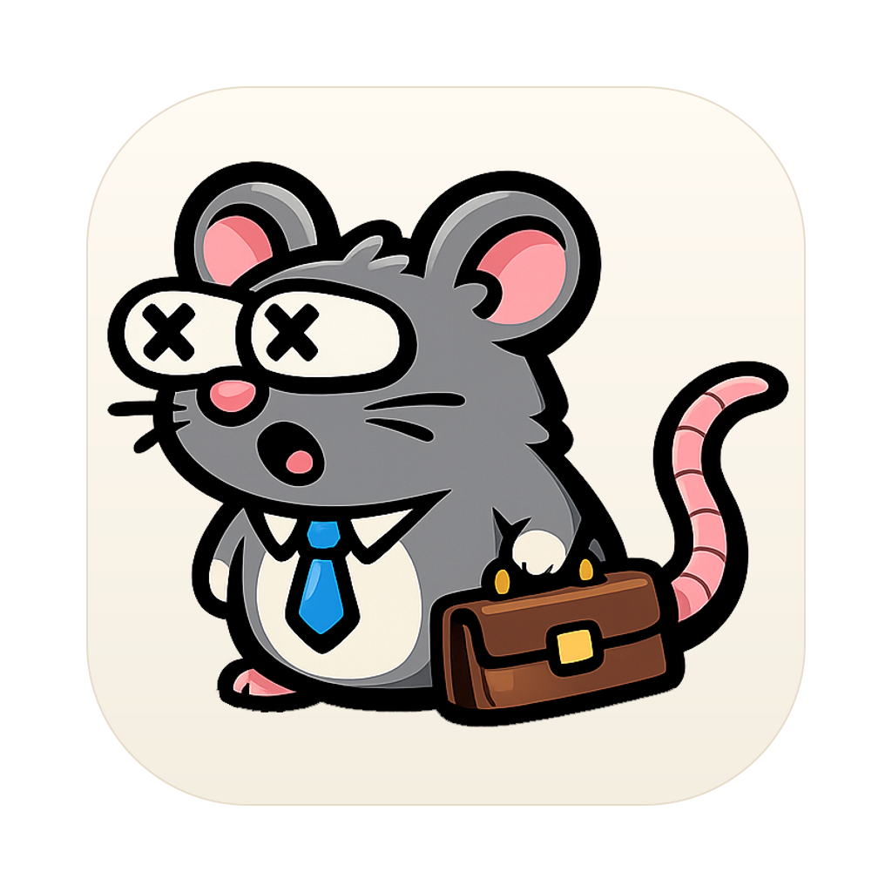
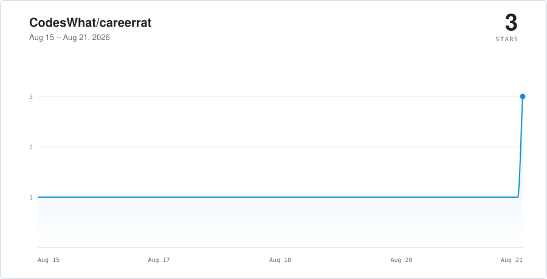

<p align="center">
  
</p>

<h1 align="center">CareerRat</h1>

<p align="center"><strong>A Mac app that turns the AI CLI you already have into a personal recruiter.</strong></p>

<p align="center">
  <a href="https://github.com/CodesWhat/careerrat/releases/latest"><strong>Download for Mac</strong></a>
  · <a href="https://careerrat.com/docs">Docs</a>
  · <a href="https://github.com/CodesWhat/careerrat">GitHub</a>
</p>

<p align="center">
  <a href="https://github.com/CodesWhat/careerrat/releases/latest"></a>
  <a href="https://www.npmjs.com/package/careerrat"></a>
  <a href="https://github.com/CodesWhat/careerrat/actions/workflows/ci-verify.yml"></a>
  <a href="https://securityscorecards.dev/viewer/?uri=github.com/CodesWhat/careerrat"></a>
  <a href="LICENSE"></a>
</p>

<p align="center"><small>CareerRat itself costs nothing. Your AI provider may have its own plan or usage costs.</small></p>

## Rate. Apply. Track

CareerRat reads the full job posting against your location, compensation floor,
fit, and dealbreakers before it recommends anything. It builds resumes, cover
letters, and screening answers from your real experience, then fills supported
application forms for your review. It never presses the final Submit button.

The search stays together in one local workspace: conversations, jobs, recruiter
threads, missions, files, follow-ups, interviews, and outcomes. You can leave a
thread, come back later, and CareerRat restores the relevant state without
depending on one AI vendor's session history. CareerRat owns those workflows and
threads, so the execution layer stays provider-neutral.

## Get CareerRat

The current macOS release is a signed and notarized Apple Silicon app for macOS
12 or newer.

1. [Download the latest `.dmg`](https://github.com/CodesWhat/careerrat/releases/latest).
2. Open CareerRat.
3. Choose Claude Code or Codex if it is ready. If neither is installed, CareerRat
   walks you through getting Claude, installing it inside the app, and signing in.

[Claude Code](https://docs.anthropic.com/en/docs/claude-code/overview) and
[OpenAI Codex](https://developers.openai.com/codex/cli/) are CareerRat's only
supported product runtime choices. Both use the same CareerRat-owned workflows,
skills, and durable state. The packaged app invokes the selected installed CLI
directly and never falls back to or silently switches providers. A runtime
becomes `Ready` only after local availability, authentication, and its readiness
check pass.

v0.16.5 is the current public release. Its signed, notarized, and stapled Mac
DMG, updater ZIP, update feed, and SBOM are on GitHub; `careerrat@latest` is
0.16.5 on npm; the Homebrew cask is 0.16.5; and the installed app reports
version 0.16.5, passes Gatekeeper, launches cleanly, and reports that it is up to
date. The release also passed a real signed 0.16.4-to-0.16.5 in-app update.

v0.16.5 preserves plain-English recovery, remote and office-day limits,
validated application entry points, and signed in-app Mac updates from v0.16.4.
It also closes the remaining raw-error paths in guided installation, expanded
diagnostics, browser-workflow cards, Search status, and browser setup.

v0.16.6 is an unreleased release candidate. It fixes AI web searches that ran
past the old two-minute limit and rechecks canonical job descriptions against
location, office-day, compensation, seniority, eligibility, and saved fit-band
rules before results are saved. It also adds candidate-facing application-answer
review inside each job thread, an in-place opt-in for supervised form preparation,
and exact mission resume after the answers are complete. Claude Code and Codex
keep the same supported workflow boundary, and CareerRat still never presses the
final Submit control. Source-level verification is green, but fresh packaged
desktop acceptance, signing, and distribution have not rerun. The public-version
claims above stay on v0.16.5 until that work is complete.

The Windows x64 installer passed build, install, launch, export, and uninstall
QA. A public Windows installer will ship only after SignPath Foundation signing
is available; SignPath requires project reputation CareerRat does not yet have.
See [Windows status](docs/WINDOWS.md).

CareerRat opens at a designed desktop size of 1280 by 860. The window is
resizable, maximizable, and supports full screen, with a minimum working size of
1100 by 680. There is no mobile app or Intel Mac build.

## First run

If CareerRat does not find Claude Code or Codex, it gives you one recommended
Claude path in plain English. Claude Code needs a paid Claude plan. Pro is
enough; Max provides more usage. You can
[get Claude through Scott's referral](https://claude.ai/referral/rOLHwxlsfA),
then click **Install inside CareerRat**. The app runs Anthropic's official
installer, shows its progress in the CareerRat window, and reports a clear retry
if it fails. Click **Sign in**, finish in the browser, and return to CareerRat.
The app checks for Claude in the background and also keeps a visible **Check
setup** button. Already use Codex? Expand **I already use another AI tool**
instead.

Choose the available AI engine, then drop a PDF, DOCX, image, or text resume into
the conversation, or just start talking. Paul fills in “What Paul knows” beside
the chat as it learns your target roles, location rules, compensation floor,
dealbreakers, evidence, and honesty boundaries.

Most profile sections are editable as a whole. You can open an editor or ask Paul
to change them in the conversation. **Application defaults** is the exception: it
stays local on this computer and never goes through Paul. Paul speaks in plain
English. When it needs an abstract choice, it gives concrete examples instead of
making you decode job-search jargon. For example: “What would make one job worth applying to before another?
The kind of work, a schedule and pay that fit, or room to grow?” Progress saves
continuously. Once the minimum search profile is ready, CareerRat starts the first
location-aware search while the rest of onboarding continues. When setup finishes,
the app opens Search and says clearly whether that search is running, found matches,
needs a retry, or is ready to start.

From there, ask it to find roles, evaluate a posting, tailor an application,
prepare an interview, or pick up a saved thread. Tool work appears as compact
activity rows in the conversation, so you can see what it is reading, searching,
and writing without a wall of approval prompts.

## The workspace

The app uses one desktop shell with three working areas:

- The left rail holds the main conversation, job and recruiter threads,
  research, Deep ingest, mock interviews, and the current view.
- The conversation stays in the center. Job-search actions and skill results
  return here instead of opening a second product.
- The right panel shows structured profile or job facts as the conversation
  discovers them. Whole sections open in focused editors when needed.

Search, Pipeline, Files, People, and Schedule are alternate views of the same
local state. Missions turn longer work into resumable, ordered steps with clear
user gates. Deep ingest gets its own durable thread. Mock interviews preserve
the session and debrief. “Needs You” groups actions such as reviewing several
prepared applications into one focused handoff.

CareerRat stores canonical candidate state, conversations, missions, mock
sessions, and pipeline records in local SQLite. Job descriptions, research,
interview dossiers, resumes, and exports remain readable Markdown, PDF, or other
normal files. A conversation is not just a Markdown transcript. Returning to a
thread rehydrates the selected engine from CareerRat's own bounded context. See
the [chat-first runtime](docs/CHAT_FIRST_RUNTIME.md).

## Safety boundary

- Every job is read in full before tailoring or application work begins.
- Generated claims must trace back to candidate evidence. Missing facts are
  asked for or left out, never invented.
- Authenticated browser, mail, calendar, and message access is opt-in when a
  specific workflow needs it.
- Application automation fills safe, confirmed fields and can attach the
  generated résumé. When an application needs a candidate answer, the job thread
  shows that question in its review panel and saves the response against the
  exact form question before preparation resumes. Voluntary demographic and
  self-identification questions stay blank by default. In **Profile > Application defaults**,
  you can leave them blank or choose the form's decline option when
  one is available. CareerRat never infers an answer. Exact sensitive answers
  stay hidden in this editor, and the setting never goes through Paul.
- CAPTCHA, two-factor authentication, sensitive attestations, uncertainty, and
  final submission stop for the user. CareerRat never presses Submit.
- Durable state changes go through the same local domain layer whether they came
  from chat, a mission, or a focused view.

## Local data and privacy

CareerRat has no product account, hosted candidate database, or app telemetry.
Your workspace stays on your machine and can be exported.

Outbound connections are limited to the work you ask for and a few explicit
product boundaries:

- The selected AI CLI connects to its own provider under that provider's account
  and privacy terms.
- Search, research, and browser skills fetch the public or authenticated pages
  needed for the task you started.
- The Mac app checks GitHub's `latest-mac.yml` SHA-512 checksum metadata at most
  once a day. It sends no candidate data and no unique installation or device
  identifier. When a newer version exists, it downloads the signed and notarized
  app update. Nothing installs until you choose **Restart and install**.
  Automatic checks can be disabled in Settings, and “Check for Updates…” still
  works as a manual check-and-download action. Windows self-update stays off until
  its installed app and final installer share a complete signing chain.
- The public website uses cookieless, privacy-limited aggregate analytics. The
  local app does not load that website analytics client.

Read the full [privacy documentation](https://careerrat.com/docs/advanced/privacy),
[data contract](docs/DATA_CONTRACT.md), and [Code signing policy](docs/CODE_SIGNING_POLICY.md).

## All 28 skills

The app and terminal flow share the same public skill definitions.

<details>
<summary><strong>Setup and intake</strong></summary>

- `ingest-profile`: conversational candidate setup and resume intake
- `resume-extract`: structured facts from PDF, image, or DOCX resumes
- `intake-extract`: verbatim extraction from general dropped files
- `configure`: inspect and change validated CareerRat settings

</details>

<details>
<summary><strong>Find and research</strong></summary>

- `setup-searches`: turn targeting into a reviewed source configuration
- `search-jobs`: search configured sources, dedupe, check liveness, and triage
- `discover-companies`: find likely employers and resolve their career boards
- `research-boards`: find and validate additional job boards
- `research-company`: build a cited company brief
- `research-comp`: benchmark compensation for a role and location
- `company-health`: assess role-specific company stability and momentum
- `relationship-sourcing`: find recruiters, hiring teams, and warm contacts

</details>

<details>
<summary><strong>Evaluate and apply</strong></summary>

- `evaluate-job`: full-posting fit, compensation, location, and action gate
- `coach-gaps`: turn review-worthy fit gaps into an honest plan
- `tailor-application`: produce evidence-backed resumes and application artifacts
- `answer-question`: answer screening questions from saved evidence and defaults
- `apply-job`: orchestrate evaluation, artifacts, form filling, and user review
- `optimize-linkedin`: propose evidence-backed LinkedIn profile improvements

</details>

<details>
<summary><strong>Pipeline and communication</strong></summary>

- `email-comms`: draft and track recruiter and hiring-team messages
- `schedule-meeting`: handle scheduling threads and availability replies
- `calendar-sync`: write approved search events to supported calendars
- `ingest-mail`: fold recruiter and application email into the workspace
- `ingest-messages`: capture LinkedIn and Wellfound message threads
- `sync-status`: read ATS dashboards and normalize application status
- `track-outcomes`: record transitions, rejections, advances, and learnings

</details>

<details>
<summary><strong>Interview, strategy, and support</strong></summary>

- `interview-prep`: create interview packets, practice, and debriefs
- `reevaluate-strategy`: tune the search from accumulated funnel outcomes
- `report-issue`: diagnose CareerRat failures and prepare redacted reports

</details>

## Terminal and source use

Terminal mode requires Node.js 24 or newer and launches Claude Code or Codex.
Both use the same canonical skills and local data.

```bash
npm install -g careerrat
careerrat start claude
# or
careerrat start codex
```

Useful terminal commands:

```bash
careerrat next          # show the next useful agent-led workflow
careerrat doctor        # verify setup, data, skills, and runtime health
careerrat update        # update an npm installation without touching user data
careerrat tracker       # write a recovery snapshot and summary
careerrat tracker-dev   # serve the local browser workspace at localhost:7777
```

To contribute from source:

```bash
git clone https://github.com/CodesWhat/careerrat
cd careerrat
npm install
npm run hooks:install
npm link
careerrat start claude
```

The repository convention is in [AGENTS.md](AGENTS.md). Architecture, release,
and product direction live in [docs/ARCHITECTURE.md](docs/ARCHITECTURE.md),
[docs/RELEASE.md](docs/RELEASE.md), and [docs/ROADMAP.md](docs/ROADMAP.md).

## Community and trust

- [Issues](https://github.com/CodesWhat/careerrat/issues) for bugs and feature requests
- [Discussions](https://github.com/CodesWhat/careerrat/discussions) for questions and ideas
- [CodesWhat Discord](https://discord.gg/mWHCPJRzSx) for chat
- [Security policy](.github/SECURITY.md) for private vulnerability reporting
- [MIT License](LICENSE)

<picture>
  <source media="(prefers-color-scheme: dark)" srcset="apps/website/public/star-history-dark.svg">
  
</picture>
