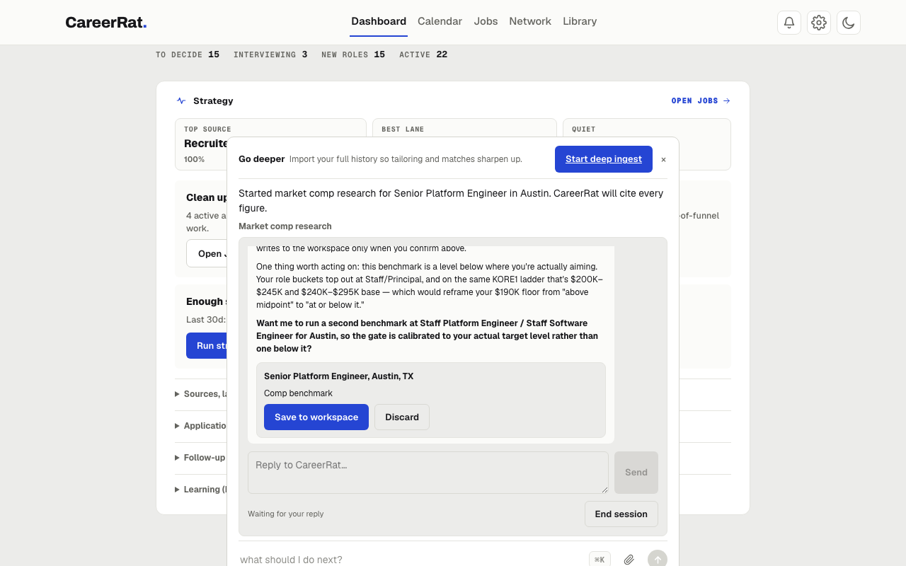

Once CareerRat is up (via `careerrat start`, or the Mac app) and your agent is
live, use it the way a real candidate would. Here is the fastest path to confirm the full stack — CLI, skills,
agent reasoning, and the live dashboard — is working end to end.

## The 5-step test loop

### 1. Let it onboard you

The agent builds your profile by asking a few questions. To test without using
real details:

> set me up with a quick sample profile so I can test the flow

### 2. Paste a job posting and ask it to evaluate

Copy a job description from anywhere (a posting URL, raw JD text, or the bundled
sample at `examples/sample-jobs/`) and paste it into the agent chat. Say:

> evaluate this

You should get a structured verdict:

```
GATE: KEEP — strong overlap with role targets
FIT: high 88 — ...
COMP: clear — posted range covers target_base
ACTION: apply-now
```

Watch for activity lines while it works, reading the posting and maybe
searching, each settling before the verdict prints.

This is a real read of the posting body against your config — not a keyword
match. If the posting is a poor fit you will get `GATE: CUT` with a reason.

Here is a finished Ask run once its activity lines settle, this one researching
market comp:



### 3. Ask it to tailor

> write a resume and cover letter for this

The agent builds honest artifacts from your evidence bank. It will not invent
facts. If you used the sample profile from step 1, the output will be illustrative
rather than personalized.

### 4. Paste a recruiter email

Copy any recruiter message (even a generic one) and paste it. Say:

> draft a reply

The agent routes to the `email-comms` skill, drafts a reply in your writing style,
and tracks the thread.

### 5. Check the dashboard

Open `http://localhost:7777` and watch the application appear, move through the
funnel, and accumulate activity. Quick local actions write through the same
canonical data layer as the CLI; longer work opens the owning skill in Ask. Each
step shows as a live activity line, an icon and a plain-language label like
"Reading files: resume.pdf" or "Searching the web", with a spinner that settles
once the step finishes. The assistant only speaks to ask a question or hand you
a result.

If all five land, CareerRat is working end to end.

## Test search discovery too

Ask CareerRat to search for a real role family and location. Built-in public
job-board sources run alongside broad AI open-web discovery, and CareerRat finds
additional specialist boards and employer pages from your saved roles. A
credible AI result with no readable full description should still
appear as **AI · unverified**, with its title, company, link, and visible search
evidence. Choose **Evaluate** to verify liveness and capture the full posting
before CareerRat treats it as application-ready.

When a saved site is added or first used and login is needed, CareerRat asks “Do
you want to log into LinkedIn so I can use it?” Yes opens that exact saved search
in the visible app browser. No skips it and keeps the rest of the search moving.
You do not need to find a search permission switch in Settings.

While the search runs, navigate to Pipeline or Files and return to Search. The
operation should continue in the background. Reloading should restore its status;
if the app is interrupted, it should offer a clear retry rather than claim the
search completed.

## Using the bundled sample

The repo ships a fictional sample candidate ("Riley Chen") and sample job in
`examples/`:

```
examples/
  sample-candidate/   ← illustrative candidate config files
  sample-jobs/        ← a sample JD to evaluate
  demo-workspace/     ← a pre-seeded tracker for demos
```

You can point the agent at the sample JD directly:

> evaluate the job in examples/sample-jobs/

## Let the agent run the test itself

If you prefer to hand it off entirely, open your agent in the repo root and say:

> read the README and AGENTS.md, set yourself up, and walk me through testing
> CareerRat end to end

The agent will self-direct through the full loop.

## Expected pre-setup behavior

Until `ingest-profile` has run, `careerrat doctor` reports that local candidate
setup is incomplete and lists the `candidate/*.yml` files to create. That is the
expected pre-setup state — the agent fills them in during onboarding. It is not
an error.
